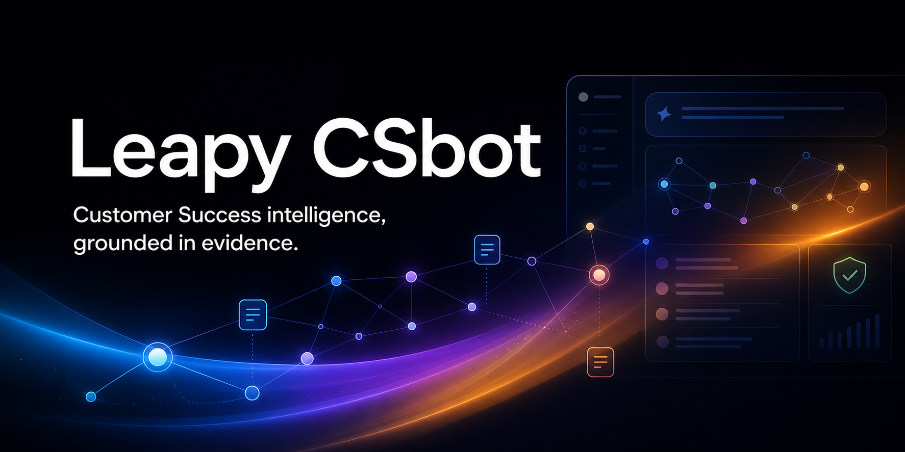

# Leapy CSbot

Protótipo de copiloto para Customer Success com recuperação Graph-RAG, respostas estruturadas, referências documentais e fallback seguro. A base inclui conteúdo de demonstração; ela não representa contrato, SLA, parecer jurídico nem catálogo comercial da Leapy.



O Leapy CSbot transforma perguntas operacionais em orientações rastreáveis: recupera evidências na base documental, expande contexto pelo grafo de conceitos, sinaliza risco e mantém cada resposta auditável.

## Execução local

Pré-requisitos:

- Node.js 20 ou superior;
- npm 10 ou superior.

Instale as dependências e inicie o modo de desenvolvimento:

```bash
npm install
npm run dev
```

A aplicação fica disponível em `http://localhost:3000`. O servidor Express incorpora o Vite em modo middleware, portanto não é necessário iniciar frontend e backend separadamente.

O modo padrão é **Simulação Local** e não exige credenciais. Para usá-lo, não crie `.env.local` e mantenha “Simulação Local” selecionado na interface.

Comandos de validação:

```bash
npm run lint
npm run test:smoke
npm run build
```

O smoke test executa exatamente 610 perguntas contra a API em modo simulado e verifica intenção, ativação de fallback e presença de 1 a 3 fontes em cada resposta.

## Arquitetura

O protótipo é um monólito em camadas:

1. `src/`: interface React 19 e tipos compartilhados;
2. `server.ts`: API Express, política de resposta, integração opcional com modelos e auditoria em memória;
3. `server/db.ts`: nós documentais, conceitos, arestas e recuperação lexical com expansão de grafo;
4. `/api/chat`: recebe a pergunta, recupera contexto, classifica a intenção e devolve os blocos estruturados;
5. `/api/graph`, `/api/logs` e `/api/feedback`: visualização da base, auditoria e feedback.

O contrato de cada resposta contém `respostaObjetiva`, `fontes`, `justificativa`, `confianca`, intenção, risco e próxima ação. `fontes` é sempre uma lista de 1 a 3 referências existentes na base, por exemplo `DOC-002 §2.1`. A interface permite abrir a referência correspondente no grafo.

## Modos de resposta

### Simulação local — recomendado para avaliação

- não usa rede externa;
- não requer chave de API;
- gera respostas determinísticas para os intents suportados;
- recusa preço, SLA, certificações e integrações específicas sem base confirmada.

As respostas simuladas servem apenas para demonstrar o fluxo do produto. Elas não comprovam funcionalidades, cobertura regional, integrações, condições comerciais ou controles de segurança reais da Leapy.

### Provedores opcionais

O protótipo possui adaptadores para Gemini, OpenAI, OpenRouter e NVIDIA NIM. Credenciais são opcionais e não são necessárias para executar, testar ou gravar a demonstração no modo simulado.

Se um provedor externo for usado, configure a chave pela interface ou em `.env.local`, seguindo os nomes de `.env.example`. Nunca faça commit desse arquivo. O servidor não registra chaves nem prefixos de chaves no console.

## Limitações conhecidas

- base e logs ficam em memória e são perdidos ao reiniciar;
- recuperação lexical não substitui busca vetorial de produção;
- o classificador local cobre somente os oito intents demonstrados;
- os documentos `DOC-SYN-*` e demais exemplos marcados como fictícios são dados de teste;
- referências indicam o trecho usado pelo protótipo, não homologação jurídica ou comercial;
- integrações com modelos externos dependem de disponibilidade, custo e política do provedor;
- o protótipo não possui autenticação, autorização, persistência, observabilidade ou controles de produção.

## Roteiro rápido de demonstração

1. mantenha o provedor em “Simulação Local”;
2. pergunte: `Qual é a faixa etária permitida para o jovem aprendiz?`;
3. mostre a resposta e abra uma das referências `DOC-003`;
4. pergunte: `Qual é o SLA contratual e o preço do plano?`;
5. mostre o fallback, a confiança “Nenhuma” e as fontes de política `DOC-008`;
6. abra a auditoria para comparar os dois registros.

O roteiro detalhado está em `deliverables/ROTEIRO_VIDEO_2MIN30.md`.
